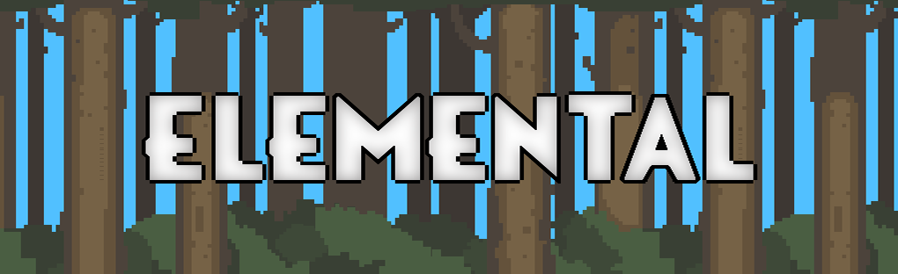
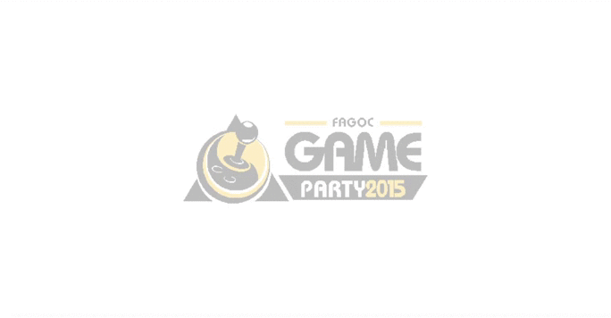
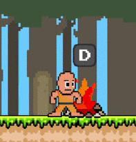
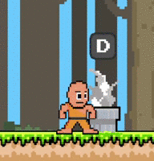
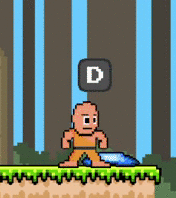
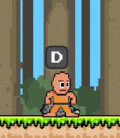

<h1 align="center">
    
</h1>

Game desenvolvido para evento Fagoc Game Party 2015 na faculdade

O Game <b>Elemental</b> foi desenvolvido na plataforma Construct 2, para a participação do evento Fagoc Game Party no ano de 2015, onde o objetivo era mostrar ao público os aprendizados do curso de Ciências da Computação.
Desenvolvi um jogo no estilo plataforma, onde são utilizadas várias mecânicas no personagem, como movimentação, ataques, coletar itens e etc.
O personagem, um monge treinado para absorver os elementos e propriedades dos objetos está em busca das páginas perdidas do livro sagrado de seu mestre.

Esse é um projeto curto, com o objetivo de mostrar como foi elaborada a lógica por trás do game durante as várias situações que o personagem se encontra.

 

<table border="0px">
  <tr>
    <td></td>    
    <td></td>
  </tr>
</table> 

 

  <table border="0px">
    <tr>
      <td></td>
      <td></td>
    </tr>
    <tr>
      <td></td>
      <td></td>
    </tr>
  </table> 

 
Link para acessaro o jogo: https://www.edsonwander.site/elemental/
